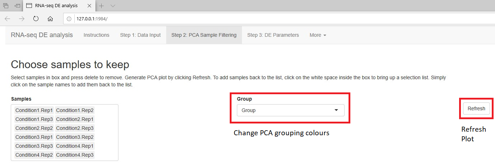
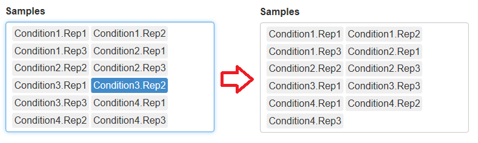
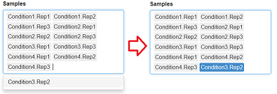
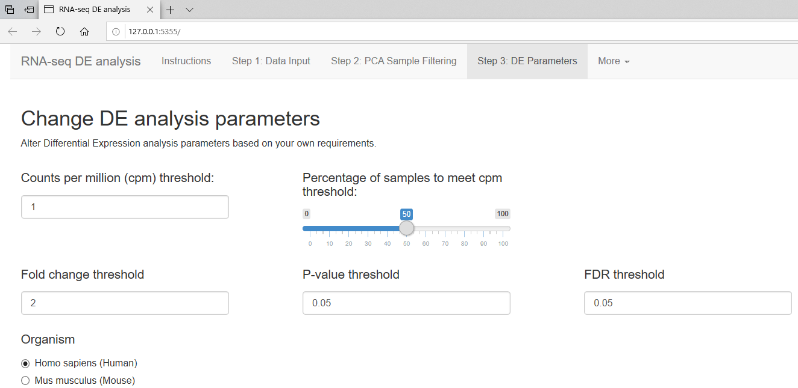
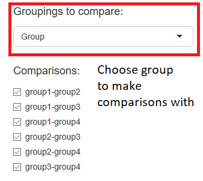
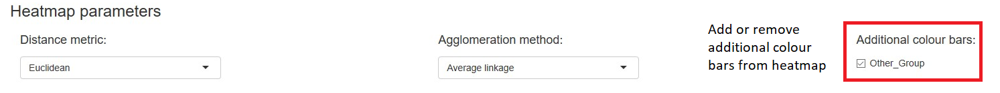
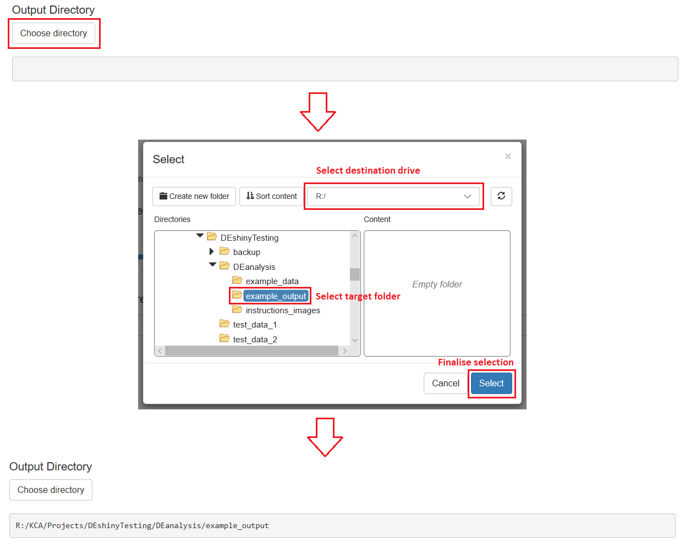
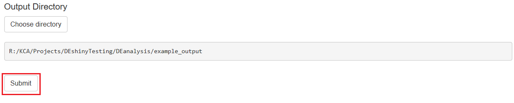

```{r setup, include=FALSE}
knitr::opts_chunk$set(echo = TRUE)
```

## RNA-seq DE analysis ShinyApp

This shiny application has been designed to provide minimal interference with the raw code for the RNA-seq DE analysis. The application involves three main steps, Data Input, Sample Filtering and Parameter changes.

<br />

### Step 1: Data Input

The first step of the analysis is to provide the data necessary for the analysis. To input a file, click Browse... and select a file using the file explorer. 

The first file is the Raw counts file often labelled with the "_rawCounts.txt" suffix. <br />

The second file is the TPM counts file often labelled with the "_TPM_Counts.txt" suffix. <br />

The third file is a user created tab-delimited file which must contain at least two columns, "Samples" and "Group". The "Samples" column should contain the sample names as they show up in the raw or TPM count files. The "Group" column(s) must contain the respective groups for the given samples as a string. The group identifiers can be changed to whatever you like as long as it is a single string without spaces or special characters. The table must contain the headers, "Samples" followed by the names of the groups (can be whatever you like). An example of a suitable input file is shown below: <br />

```{r echo=FALSE}
example <- read.table("example_data/test_data_1/exampleSamples.txt", header = T)
example
```

After loading a table in the file input it can be viewed by selecting the table of choice using the drop down menu. Double check that the right files have been loaded in the correct input!

If there are missing necessary columns the application will display messages next to the respective file input.

Once the input data has been finalised proceed to step 2 by clicking the second step in the navigation bar at the top of the screen. 

<br />

### Step 2: PCA Sample Filtering

The second step of the analysis is to remove any samples which are deemed to be signficant outliers due to technical bias. We can observe the relative clustering of samples in a PCA to determine which samples cluster incorrectly and thus should be removed from the analysis.

An initial PCA plot with all samples can be generated by clicking the Refresh button.

PCA plot colours can be altered based on the desired group. Simply click on the Group drop-down list and choose a grouping. Then refresh the plot using the Refresh button.



Samples which are considered outliers can be removed by selecting the sample in the list on the right and pressing "delete". PCA plots can then be re-generated without the removed sample by clicking the Refresh button. If you wish to add a sample back ot the list, click on any whitespace within the list box and then select the samples to be added back from the drop down menu.





Additionally, groups can be selected to colour the PCA plot and observe specific group clustering. Simply select the group you wish to display from the Group drop-down menu and click the Refresh button.

Once you are happy with the sample list, you can proceed to step 3 of the anlaysis.

<br />

### Step 3: DE Parameters

The final step of the analysis is to change the parameters of the differential expression based on the required criteria. The paramters will affect the generated heatmaps and volcano plot. 



Additionally there is a section to choose which comparisons you wish to make. You can choose which group in which you want to make the differential expression comparisons. By default all comparisons are selected, however, you may wish to run only a subset of these for your particular analysis.



Adjustments can be made to the heatmaps by altering the options under the Heatmap parameters section. Distance metrics and clustering methods can be chosen by selecting options from the drop-down list. By default, all groups will be shown in the colour bars above the heatmaps, however, you may wish to remove some groups from the heatmap colour bars. Simply uncheck the box to remove a group from the colour bars. The output heatmaps will always have the main comparison group colour bars.



Finally, an output directory to save all results must be chosen by clicking the "Choose directory" button. Once a folder is chosen, the file path will be displayed in the box below the button.



If all parameters and filepaths have been finalised you can click the "Submit" button to run the analysis. While the analysis is running several loading bars will appear in the bottom left of the window. Once these bars have disappeared, the script has completed and the results are ready.



<br />

### Step 4: Generate Custom Plots

An optional step to produce custom plots based on the output of the DEanalysis program has been provided. Currently two types of plots can be generated with modified parameters. These are the volano plots and the heatmaps. 

Initially a folder must be specified containing the complete output of the DEanalysis program. If this step is run immediately after generating the differential expression results via the pipeline, the selected output folder will already be chosen. Step 4 can also be run independently at an alternative time if necessary. If this is the case, a folder containing the output files must be selected using the directory selection within the Step 4 section.

Once a viable directory has been selected, all group comparisons tested will be listed in the drop-down box. Simply select the group comparison that you wish use for the plots. 

After selecting an appropriate group comparison you may select either the volcano plot or heatmap tabs to generate the respective plot.

#### Volcano Plots

Volcano plots can be adjusted based on the following parameter choices:
* Statistical threshold type (ie. P-value or FDR)
* Statistical threshold
* Fold-change threshold
* Genes to label
* Output plot size (pixel width and height)

Either P-values or FDR statistics can be used in the volcano plot. Selecting either option will change the threshold selection box.

Genes can be labelled on the volcano plot using the 'ggrepel' package. To implement this, three options have been provided. The first option "Top genes (specified amount)" will label the top n genes from the significance table. The number of top genes can be specified in the numeric input box. 

Alternatively, a custom list of gene names which are identical to the gene names in the DEanalysis can be used. Two options have been provided. Either "Select input" to manually select genes from the entire gene set or "Upload list" to upload a text file containing a single gene name on each line.

If you do not want to label any genes, you can input an empty list using "Select input".

You may also wish to adjust the plot width and height (pixels) for a nicer looking output. This can be changed in the "Plot width" and "Plot height" boxes respectively.

To generate a preview of the volcano plot click "Refresh".

If you wish to save a copy of the plot, enter a file name under "Volcano plot filename to save" and click Download. This will prompt a download through the browser which you can save to your desired location. 

If any of the buttons or options have been greyed out, you may be missing the required DEanalysis output files and/or have not entered correct paramters to proceed with the generation of the plot.


#### Heatmap Plots

Volcano plots can be adjusted based on the following parameter choices:
* Distance metric
* Agglomeration method
* Samples to include
* Genes to include
* Group data information
* Labelling group data (colour bars)
* Plot average of groups in a grouping
* Apply Z-score scaling
* Display row names
* Display column names
* Transpose the heatmap (samples as rows and genes as columns)

The hierarchical clustering of samples and genes in the heatmap can be altered via the distance metric and agglomeration method. Simply choose the desired parameters from the drop down boxes. All options which can be passed to the R hclust() function have been included. 

Samples can be individually selected if desired. Simply select the "Selected samples" option and add or remove the desired samples from the selection box.

Genes can be selected in a similar manner to the Volcano Plots. Either the top n genes from the signficance table or a specified list of genes can be used as input. 

If you wish to include group information in the heatmap you may upload a group data file similar to the one uploaded in step 1. You then have the option to add specific colour bars or calculate the average of groups in a particular grouping. 

Z-score scaling across the rows (genes) can be turned off if required. Row and/or column names can also be suppressed from the plot if necessary. Additionally, heatmap X and Y axes can be transposed with genes on the y-axis and samples on the x-axis.

Once the desired parameters have been chosen click "Refresh" to generate a preview of the plot. 

If you wish to save a copy of the plot, enter a file name under "Heatmap plot filename to save" and click Download. This will prompt a download through the browser which you can save to your desired location. 

If any of the buttons or options have been greyed out, you may be missing the required DEanalysis output files and/or have not entered correct paramters to proceed with the generation of the plot.

#### Enrichment Bar Plots

Enrichment bar plots can be adjusted based on the following parameter choices:
* If UP and DOWN regulation has been separated, choose which direction to plot
* Enrichment terms to plot (eg. KEGG, GO BP, GO CC or GO MF)
* Filter lists by statistical thresholds or custom select terms
* Statistical threshold parameters (eg. P-value or adjusted P-value)
* Value for statistical threshold
* Choice of using top terms or selected terms
* Number of top terms to plot
* Custom selection of terms

Depending on if the analysis produced KEGG/GO enrichment based on UP and DOWN regulation separately, there will be an option to either choose the UP or DOWN regulated data to plot. Additionally, you may filter out certain categories of enrichment terms such as KEGG pathways, GO biological processes, GO cell cycle or GO molecular functions. 

The terms to be plotted can either be filtered using a statistical threshold based on the P-value or adjusted P-value. Alternatively, you can select 'n' top terms based on the ranking of P-value or adjusted P-value. Finally, you may wish to select a specified set of terms to plot.

Once the desired parameters have been chosen click "Refresh" to generate a preview of the plot. 

If you wish to save a copy of the plot, enter a file name under "Bar plot filename to save" and click Download. This will prompt a download through the browser which you can save to your desired location. 

If any of the buttons or options have been greyed out, you may be missing the required DEanalysis output files and/or have not entered correct paramters to proceed with the generation of the plot.

#### PathView KEGG Plots

PathView KEGG Plots can be adjusted based on the following parameter choices:
* Organism to plot
* KEGG pathway to plot
* Method for filtering gene input
* Threshold value for the the statistical filtering method
* Additional filename suffix

The pathway plots can be generated by changing the organism selection to the correct option and selection of the desired pathway to test. Please note that not all pathways in the list will be plottable, this is simply a limitation of the program itself. The genes that are inputted into the plotting program can be filtered based on a specifed P-value or FDR threshold. A suffix for the filenames can be given, simply type the desired suffix. Once all the parameters are correct, you may hit Generate/Refresh Plot to generate the KEGG plot. The plot files will automatically be saved to the directory containing the DE output files.

### Issues and troubleshooting

If there are any errors or bugs that are impeding your ability to use the application, please contact either Nisitha Jayatilleke or Chelsea Mayoh by email. Contact information can be found in the "About" section in the "More" dropdown.

<br />
